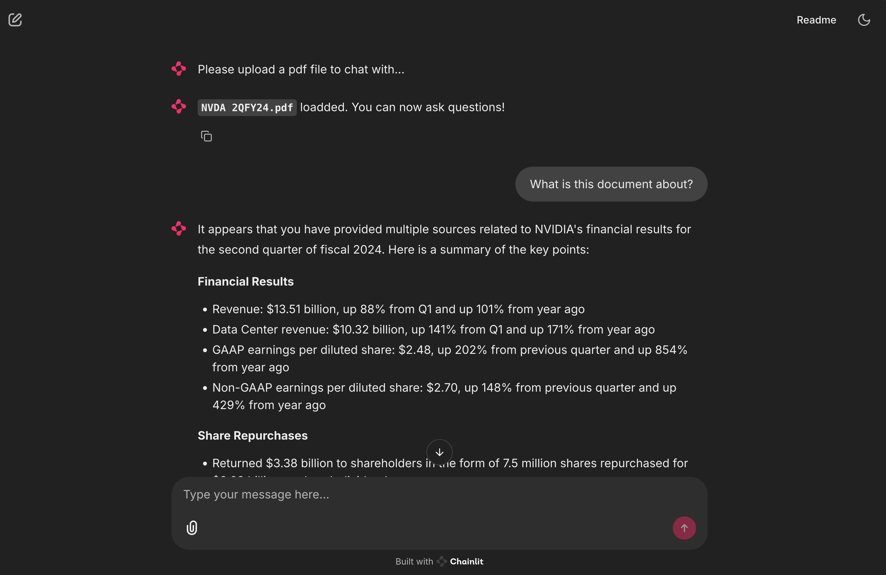

# RAG App with Local LLM

Chat-with-pdf application using a local LLM and retrieval-augmented generation (RAG).



Demo project based on [Hands-On AI: Building LLM-Powered Apps](https://www.linkedin.com/learning/hands-on-ai-building-llm-powered-apps?trk=learning-course_related-content-card&upsellOrderOrigin=default_guest_learning) course.

## Run app

1. Create venv and install dependencies
    ```bash
    uv sync
    ```
2. Install [ollama](https://ollama.com/). On mac, do:
    ```bash
    brew install ollama
    ```
3. Download llama3.1:8b model. After the download finishes, you can close the terminal session.
    ```bash
    ollama run llama3.1:8b
    ```
4. Start an ollama server. Leave the terminal session running:
    ```bash
    ollama serve
    ```
5. Ensure the venv is activated.
6. Open a terminal in the project root and start the app.
    ```bash
    chainlid run app/app.py
    ```
7. Upload the pdf in `sample_pdf/`. Wait for it to process.
8. Ask a question like "What is this document about?"

## Details

Main technologies used:
- `chainlid` - for GUI and chatbot environment
- `langchain` - for LLM integration and PDF processing
- `ollama` - for LLM server
- `chromadb` - for vector database

Calculating the chunk size when splitting text:
- Llama 3.1 (including the llama3.1-8B we are using) allows a context window of 128k tokens.
- The chunk size in RecursiveCharacterTextSplitter is in number of characters.
- The number of documents that the LLM will remember depends on the chunk size. E.g. if we set size to 25k, we can accomodate 5 chunks/documents.
